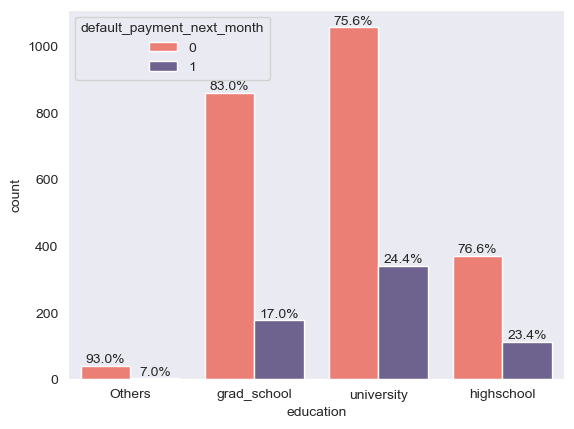

# Data Scientist Portofolio

#### Technical Skills: Python, SQL, MATLAB , Tableau, Google Looker Studio

## Education	        		
- Electrical Engineering Bachelors | Institut Teknologi PLN (_November 2021_)

## Projects
### Customer Churn Prediction using ANN

  

  

The primary objective of this analysis is to identify and predict potential churn customers who may discontinue using the service. Leveraged ANN models to predict customer churn, achieving 92% accuracy using Functional API. Identified actionable insights for effective strategy development based on factors like transaction amounts, point wallet balances, membership status, and feedback.

<table>
  <tr>
    <td></td>
    <td></td> 
  </tr>
</table>

### Segmenting Credit Card Users for Targeted Marketing Strategies: An Analysis using K-Means Algorithm"

This analysis serves as a valuable tool for the bank to develop targeted marketing strategies by gaining insights into distinct credit card user profiles. By employing the K-Means algorithm for segmentation, the bank can effectively identify and group customers with similar credit card usage patterns, enabling more personalized and tailored marketing approaches.
Based on the analysis results, almost all customers have a tenure of 12 months. Furthermore, customers with higher balances tend to prefer cash payments, avoid installment payments, have low purchase frequency, and possess high credit limits. The clustering revealed various customer profiles, indicating the need for tailored marketing approaches. For example, Cluster 1 comprises customers who frequently use installment payments, making them potential targets for offers like 0% interest promotions and more.

<table>
  <tr>
    <td></td>
    <td></td> 
  </tr>
</table>

### Predictive Analysis of Credit Card Payment Delays and Defaults using Machine Learning Algorithms

In this study, we endeavor to predict potential occurrences of credit card payment delays or defaults in the upcoming month. Leveraging available credit card data, we will employ diverse algorithms such as Logistic Regression, SVM, Decision Tree, Random Forest, KNN, Naive Bayes, and others to construct predictive models. Subsequently, we will utilize cross-validation to compare the performance of these algorithms and conduct hyperparameter tuning to optimize the selected model's predictive capabilities. Based on the analysis of various algorithms, the Logistic Regression algorithm demonstrated the best performance with a mean accuracy of 0.82% in cross-validation. It outperformed other algorithms in the evaluation of the models.

<table>
  <tr>
    <td></td>
    <td></td>
    <td></td>
  </tr>
</table>

### Data Analysis on Adidas Sales to Find Trend and Insight

  

  

Using Python, I am conducting an insightful analysis of Adidas Sales, gaining valuable insights, performing intricate calculations, and applying essential statistical concepts. Additionally, I developed an interactive dashboard using Tableau to enhance data visualization and present my findings more effectively. Throughout this project, my focus was on identifying significant trends and patterns in Adidas Sales, enabling me to make data-driven decisions for strategic sales development. By maintaining high-performing sales trends and capitalizing on opportunities to expand into potential cities, I aimed to drive sales growth and foster business expansion in the retail sector.

